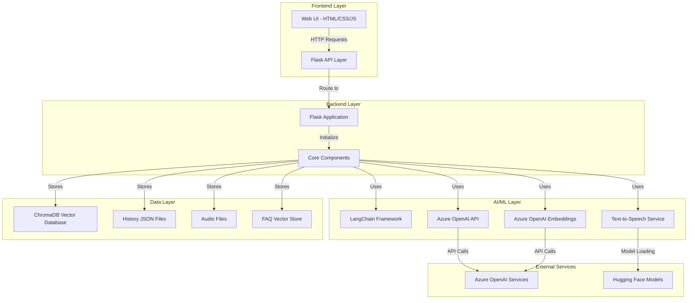
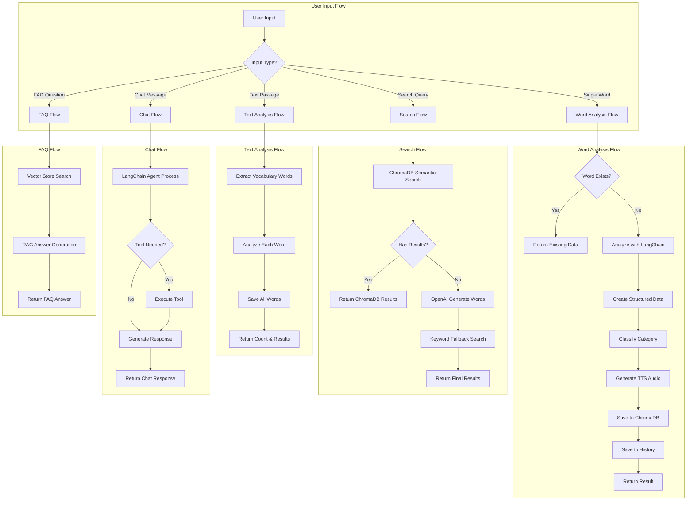
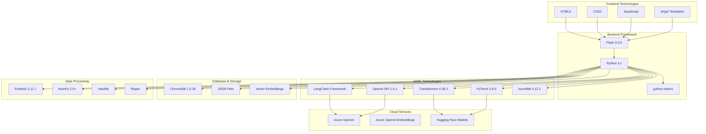
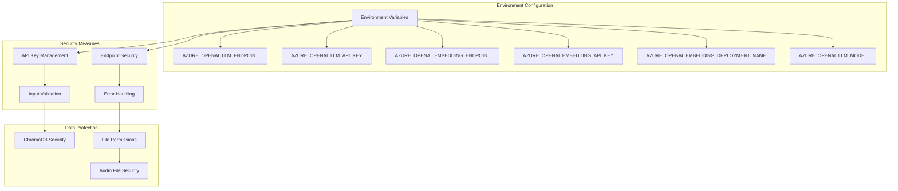
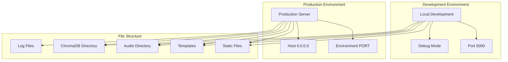

# Flashcard System Architecture Diagram

## System Overview
This document provides a comprehensive system architecture diagram for the AI-powered English Vocabulary Learning Flashcard System.

## High-Level Architecture

## Detailed Component Architecture

```mermaid
graph TB
    subgraph "User Interface"
        direction TB
        MAIN[Main Page - /]
        CHAT[Chat Interface - /chat]
        SEARCH[Search Page - /search]
        LIST[Flashcard List - /list]
        FAQ[FAQ Page - /faq]
    end
    
    subgraph "API Endpoints"
        direction TB
        API_MAIN[POST / - Add Word]
        API_CHAT[POST /api/chat - Process Chat]
        API_SEARCH[POST /api/semantic-search - Search]
        API_DELETE[POST /api/delete-word - Delete Word]
        API_CLEAR[POST /api/clear-all-data - Clear Data]
        API_CATEGORY[POST /api/search-category - Category Search]
        API_CATEGORIES[GET /api/categories - Get Categories]
        API_WORD[GET /api/word/<word> - Get Word Info]
        API_AUDIO[GET /api/generate-audio/<word> - Generate Audio]
        API_FAQ[POST /api/faq - FAQ Query]
    end
    
    subgraph "Core Business Logic"
        direction TB
        VOCAB_MGR[Vocabulary Manager]
        TTS_SERVICE[TTS Service]
        LANGCHAIN_AGENT[LangChain Agent]
        WORD_ANALYZER[Word Analyzer]
        TEXT_ANALYZER[Text Analyzer]
        SEARCH_ENGINE[Search Engine]
        FAQ_ENGINE[FAQ RAG Engine]
    end
    
    subgraph "Data Models"
        direction TB
        VOCAB_WORD[VocabularyWord Model]
        VOCAB_LIST[VocabularyList Model]
        SEARCH_RESULT[SemanticSearchResult Model]
        FAQ_DOC[FAQ Document Model]
    end
    
    subgraph "Data Storage"
        direction TB
        CHROMADB_COLL[ChromaDB Collection]
        HISTORY_JSON[History.json]
        AUDIO_FILES[Static/Audio Files]
        FAQ_VECTOR[FAQ Vector Store]
    end
    
    subgraph "External AI Services"
        direction TB
        AZURE_LLM[Azure OpenAI LLM]
        AZURE_EMB[Azure OpenAI Embeddings]
        HF_TTS[Hugging Face TTS Models]
    end
    
    subgraph "LangChain Components"
        direction TB
        LLM[ChatOpenAI]
        MEMORY[Conversation Memory]
        TOOLS[LangChain Tools]
        PROMPTS[Prompt Templates]
        PARSERS[Output Parsers]
        AGENTS[AI Agents]
    end
    
    %% User Interface to API connections
    MAIN --> API_MAIN
    CHAT --> API_CHAT
    SEARCH --> API_SEARCH
    LIST --> API_DELETE
    LIST --> API_CLEAR
    SEARCH --> API_CATEGORY
    SEARCH --> API_CATEGORIES
    MAIN --> API_WORD
    MAIN --> API_AUDIO
    FAQ --> API_FAQ
    
    %% API to Business Logic connections
    API_MAIN --> WORD_ANALYZER
    API_CHAT --> LANGCHAIN_AGENT
    API_SEARCH --> SEARCH_ENGINE
    API_DELETE --> VOCAB_MGR
    API_CLEAR --> VOCAB_MGR
    API_CATEGORY --> VOCAB_MGR
    API_CATEGORIES --> VOCAB_MGR
    API_WORD --> WORD_ANALYZER
    API_AUDIO --> TTS_SERVICE
    API_FAQ --> FAQ_ENGINE
    
    %% Business Logic to Data Models
    WORD_ANALYZER --> VOCAB_WORD
    TEXT_ANALYZER --> VOCAB_LIST
    SEARCH_ENGINE --> SEARCH_RESULT
    FAQ_ENGINE --> FAQ_DOC
    
    %% Business Logic to Data Storage
    VOCAB_MGR --> CHROMADB_COLL
    VOCAB_MGR --> HISTORY_JSON
    TTS_SERVICE --> AUDIO_FILES
    FAQ_ENGINE --> FAQ_VECTOR
    
    %% Business Logic to External Services
    WORD_ANALYZER --> AZURE_LLM
    TEXT_ANALYZER --> AZURE_LLM
    LANGCHAIN_AGENT --> AZURE_LLM
    SEARCH_ENGINE --> AZURE_EMB
    FAQ_ENGINE --> AZURE_EMB
    TTS_SERVICE --> HF_TTS
    
    %% LangChain Component connections
    LANGCHAIN_AGENT --> LLM
    LANGCHAIN_AGENT --> MEMORY
    LANGCHAIN_AGENT --> TOOLS
    LANGCHAIN_AGENT --> PROMPTS
    LANGCHAIN_AGENT --> PARSERS
    LANGCHAIN_AGENT --> AGENTS
```

## Data Flow Architecture

## Technology Stack Architecture

## Security & Configuration Architecture

## Deployment Architecture

## Key Features & Capabilities

- **AI-Powered Vocabulary Analysis**: Uses LangChain and OpenAI for intelligent word analysis
- **Semantic Search**: ChromaDB vector database with fallback mechanisms
- **Text-to-Speech**: Hugging Face TTS models for pronunciation
- **Intelligent Categorization**: Automatic category classification using AI
- **Multi-language Support**: Vietnamese and English interface
- **Conversational AI**: LangChain agents for natural language interaction
- **RAG System**: FAQ system with retrieval-augmented generation
- **Real-time Processing**: Immediate response to user queries
- **Scalable Architecture**: Modular design for easy extension
- **Error Handling**: Robust fallback mechanisms and error recovery

## Performance Characteristics

- **Response Time**: < 2 seconds for most operations
- **Concurrent Users**: Supports multiple simultaneous users
- **Data Persistence**: ChromaDB for vector storage, JSON for metadata
- **Caching**: Audio file caching to avoid regeneration
- **Memory Management**: Efficient conversation memory with windowing
- **Scalability**: Horizontal scaling capability through modular design
